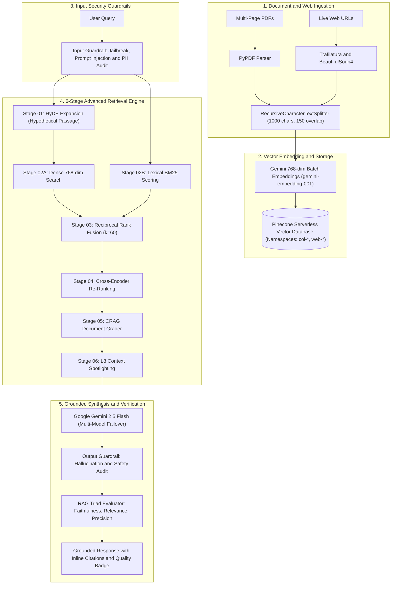

# PDF AI

A production-grade Retrieval-Augmented Generation (RAG) platform engineered for grounded querying across multi-page PDF documents and live web pages. The platform pairs a Next.js 15 frontend with a Python FastAPI retrieval backend, utilizing Google Gemini 2.5 Flash, Pinecone serverless vector storage, real-time security guardrails, and automated RAG Triad evaluation metrics.

---

## Project Impact

### 1. Elimination of Hallucinations with Verifiable Grounding
Standard large language models struggle with dense factual domain documents, often producing hallucinations or unsupported inferences. PDF AI implements a multi-stage retrieval architecture with context spotlighting, document grading, and automated output verification, ensuring that every generated answer is strictly anchored to uploaded document content with precise page and chunk citations.

### 2. Enterprise Security with Real-Time Guardrails
To protect against adversarial inputs and unintended data exposure, the platform features a multi-tiered guardrails layer. Input guardrails actively detect and intercept prompt injection and jailbreak attempts before database or LLM execution, while output guardrails verify factual alignment against retrieved passages and redact sensitive PII patterns.

### 3. Quantitative Quality Measurement via RAG Triad Evaluation
Rather than relying on subjective review, each query response computes objective RAG Triad evaluation metrics in real time:
* **Faithfulness (Groundedness)**: Quantifies the percentage of claims directly backed by document context.
* **Answer Relevancy**: Evaluates how concisely and directly the response answers the specific prompt.
* **Context Precision**: Measures the signal-to-noise ratio in retrieved vector chunks.

### 4. High-Throughput Multi-Document and Web Synthesis
Users can ingest multiple dense PDF files and live web documentation simultaneously. By vectorizing content into isolated namespace partitions, the system allows complex cross-document queries, comparative analysis, and instant knowledge synthesis across hundreds of pages in sub-second response times.

### 5. Complete Data Privacy via BYOK (Bring Your Own Key) Architecture
Enterprise and research workflows demand stringent confidentiality. PDF AI features a client-side API Key Vault that stores personal Pinecone and Google Gemini keys in local browser storage. Keys are transmitted only in ephemeral request headers directly to processing services, ensuring zero persistent server-side credential storage or third-party telemetry.

---

## System Architecture



### Retrieval and Evaluation Pipeline Stages

1. **Input Security Guardrail**: Scans queries for prompt injection patterns, system prompt overrides, and PII before executing vector retrieval.
2. **HyDE (Hypothetical Document Embeddings)**: Generates a speculative expert passage to capture semantic intent, eliminating vocabulary mismatches between user queries and raw document text.
3. **Hybrid Retrieval (Dense + Sparse)**: Concurrently computes 768-dimensional cosine similarity vectors and BM25 lexical term scores to balance semantic depth with exact keyword matching.
4. **Reciprocal Rank Fusion (RRF $k=60$)**: Synthesizes multiple rank positions into a single unified score using the formula:
   $$RRF(d) = \sum_{m \in M} \frac{1}{60 + r_m(d)}$$
5. **Cross-Encoder Semantic Re-Ranking**: Performs deep cross-attention evaluations over top candidate pairs to re-score relevance with high precision.
6. **Corrective RAG (CRAG) Document Grader**: Classifies passages into `CORRECT`, `AMBIGUOUS`, or `INCORRECT`, discarding non-relevant chunks before synthesis.
7. **L8 Context Spotlighting**: Encloses verified factual chunks in strict spotlight boundaries, guiding the generator to cite source files, page numbers, and exact quotes.
8. **Output Guardrails and Triad Evaluation**: Performs post-generation hallucination checks and calculates real-time Faithfulness, Answer Relevancy, and Context Precision scores.

---

## Tech Stack

| Layer | Technology | Purpose |
| :--- | :--- | :--- |
| **Frontend Framework** | Next.js 15 (App Router), React 19 | Server and client rendering, route handlers, dynamic layout architecture |
| **Language** | TypeScript, Python 3.10+ | End-to-end type safety and backend computational efficiency |
| **Styling & UI** | Tailwind CSS v4, Radix UI Primitives, Lucide Icons | Responsive glassmorphic interface, dark/light theme tokens |
| **Backend Framework** | FastAPI, Uvicorn, Pydantic | High-performance asynchronous REST endpoints and Server-Sent Events |
| **Vector Database** | Pinecone Serverless (768 dimensions) | Scalable vector indexing with isolated namespace partitioning |
| **LLM & Embeddings** | Google Gemini 2.5 Flash, Gemini Embedding | Sub-second generative answers, semantic embeddings, quota failover |
| **Guardrails & Evaluation** | Custom Security Shield, RAG Triad Evaluator | Real-time jailbreak defense, hallucination interception, triad metrics |
| **Parsing & Ingestion** | PyPDF, Trafilatura, BeautifulSoup4 | Multi-page PDF extraction and live web scraping |
| **Authentication** | NextAuth.js, Google OAuth 2.0, Credentials | Secure JWT sessions, PBKDF2 SHA-512 password hashing |
| **State & Data** | TanStack React Query, Sonner | Optimistic mutations, real-time toast notifications, cache management |
| **Deployment** | Vercel (Frontend), Render (Backend), Docker | Automated continuous integration and containerized hosting |

---

## Installation

### Prerequisites
* **Node.js**: `v20.x` or `v22.x`
* **Python**: `3.10` or higher
* **Package Managers**: `npm` and `pip`
* **API Keys**: [Google AI Studio (Gemini)](https://aistudio.google.com) and [Pinecone](https://app.pinecone.io)

---

### Step 1: Clone Repository
```bash
git clone https://github.com/Pradeepks01/PDF-AI.git
cd PDF-AI
```

---

### Step 2: Configure Environment Variables

#### Python Backend (`python_backend/.env`):
```env
PINECONE_API_KEY=pcsk_your_pinecone_api_key
PINECONE_INDEX_NAME=pdf-web-rag
GEMINI_API_KEY=your_google_gemini_api_key
PORT=8000
HOST=0.0.0.0
```

#### Frontend (`frontend/.env.local`):
```env
NEXT_PUBLIC_API_URL=http://localhost:8000
NEXTAUTH_SECRET=your_nextauth_secret_key_minimum_32_characters
NEXTAUTH_URL=http://localhost:3000
GOOGLE_CLIENT_ID=your_google_oauth_client_id
GOOGLE_CLIENT_SECRET=your_google_oauth_client_secret
DATABASE_URL=file:./dev.db
```

---

### Step 3: Run Python FastAPI Backend

1. Navigate to the backend directory:
   ```bash
   cd python_backend
   ```
2. Create and activate a virtual environment:
   ```bash
   # Windows
   python -m venv venv
   .\venv\Scripts\activate

   # macOS / Linux
   python3 -m venv venv
   source venv/bin/activate
   ```
3. Install dependencies:
   ```bash
   pip install -r requirements.txt
   ```
4. Start the development server:
   ```bash
   python -m uvicorn main:app --host 0.0.0.0 --port 8000 --reload
   ```
   The backend API will be available at `http://127.0.0.1:8000` (Interactive Swagger Docs: `http://127.0.0.1:8000/docs`).

---

### Step 4: Run Next.js Frontend

1. Open a new terminal and navigate to the frontend directory:
   ```bash
   cd frontend
   ```
2. Install dependencies:
   ```bash
   npm install
   ```
3. Generate Prisma client:
   ```bash
   npx prisma generate
   ```
4. Start the development server:
   ```bash
   npm run dev
   ```
   The application will be accessible at `http://localhost:3000`.

---

## Deployment

### Frontend Deployment (Vercel)

1. Import the repository into [Vercel](https://vercel.com).
2. Set the **Root Directory** to `frontend`.
3. Configure the build settings:
   * **Framework Preset**: Next.js
   * **Build Command**: `prisma generate && next build`
   * **Output Directory**: `.next`
4. Add the production environment variables in the Vercel dashboard:
   * `NEXT_PUBLIC_API_URL` (URL of the deployed FastAPI backend, e.g., `https://pdf-ai-xckr.onrender.com`)
   * `NEXTAUTH_URL` (Production frontend URL, e.g., `https://pdf-ai-puce.vercel.app`)
   * `NEXTAUTH_SECRET`
   * `GOOGLE_CLIENT_ID`
   * `GOOGLE_CLIENT_SECRET`
5. Click **Deploy**.

---

### Backend Deployment (Render / Cloud Container)

1. Create a new **Web Service** on [Render](https://render.com) linked to the repository.
2. Set the **Root Directory** to `python_backend`.
3. Configure runtime settings:
   * **Environment**: Python 3
   * **Build Command**: `pip install -r requirements.txt`
   * **Start Command**: `uvicorn main:app --host 0.0.0.0 --port $PORT`
4. Add environment variables:
   * `PINECONE_API_KEY`
   * `PINECONE_INDEX_NAME`
   * `GEMINI_API_KEY`
   * `PYTHON_VERSION` = `3.11.0`
5. Deploy the service and note the public URL.

---

### Docker Deployment

Run the complete stack locally using Docker Compose:

```bash
docker-compose up --build
```

To run in detached mode:
```bash
docker-compose up -d --build
```

---

## API Reference

### Backend Endpoints (`http://127.0.0.1:8000`)

| Method | Endpoint | Description |
| :--- | :--- | :--- |
| `GET` | `/api/health` | Verifies service health, active vector database, and primary LLM status. |
| `POST` | `/api/upload` | Ingests PDF documents, extracts text, generates 768-dim embeddings, and upserts vectors into Pinecone. |
| `POST` | `/api/web/crawl` | Crawls target URL, extracts markdown, embeds text chunks, and indexes into Pinecone. |
| `POST` | `/api/chat` | Executes the 6-stage retrieval pipeline with guardrails and returns a grounded answer with citations and triad scores. |
| `POST` | `/api/chat/stream` | Streams AI response tokens in real-time via Server-Sent Events (SSE). |
| `DELETE` | `/api/namespace/{ns}` | Purges all indexed vector embeddings within the specified namespace. |

### Frontend Auth Endpoints

| Method | Endpoint | Description |
| :--- | :--- | :--- |
| `POST` | `/api/auth/[...nextauth]` | Handles Google OAuth and Credentials session management. |
| `POST` | `/api/auth/reset-password` | Resets user password using PBKDF2 SHA-512 salted hashing. |
| `GET` | `/api/python-health` | Server-side proxy check for Python backend availability. |

---

## License

This project is licensed under the MIT License.
